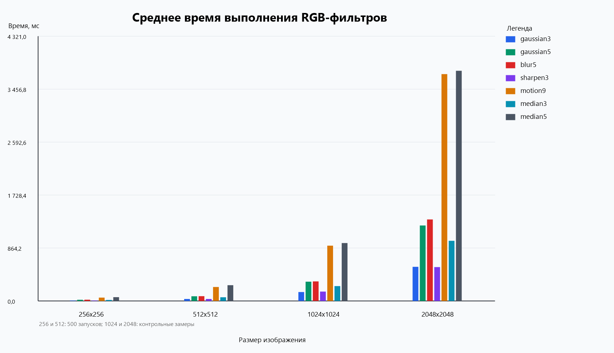
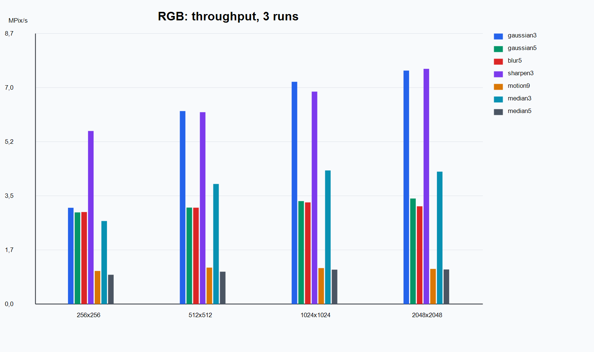

# Последовательная и параллельная фильтрация изображений

## Описание

В работе реализована последовательная и параллельная обработка изображений в градациях серого с использованием линейной свёртки и median filter.

Поддерживаются следующие фильтры:

- `identity`
- `blur3`
- `blur5`
- `gaussian3`
- `gaussian5`
- `gaussian3_exact`
- `motion9`
- `edge_horizontal5`
- `edge_vertical5`
- `edge_45deg5`
- `edge_all3`
- `sharpen3`
- `sharpen5`
- `edge_excessive3`
- `emboss3`
- `emboss5`
- `mean3`
- `median3`
- `median5`
- `median7`

Для параллельной обработки одного изображения поддерживаются стратегии разбиения:

- `pixels` — потоки динамически забирают отдельные пиксели через общий счётчик
- `rows` — изображение делится на горизонтальные полосы
- `columns` — изображение делится на вертикальные полосы
- `grid` — изображение делится на прямоугольную решётку

## Сборка и запуск

### Требования

Для сборки и запуска проекта должны быть установлены:

- Git
- Maven
- Java 24

Проект компилируется с настройкой `source = 22`, а замеры производительности выполнялись на Java 24.

### 1. Клонирование репозитория

Склонировать проект с GitHub:

```bash
git clone <repo_url>
```

Перейти в каталог проекта:

```bash
cd <repo_name>
```

> Вместо `<repo_url>` нужно подставить ссылку на репозиторий,  
> а вместо `<repo_name>` — имя папки проекта после клонирования.

### 2. Сборка проекта

Собрать проект с помощью Maven:

```bash
mvn clean package
```

После успешной сборки скомпилированные `.class`-файлы будут находиться в каталоге `target/classes`.

### 3. Запуск программы

#### Применить фильтр к изображению

```bash
java -cp target/classes Main apply <input> <output> <filterName>
```

Пример:

```bash
java -cp target/classes Main apply input.png output.png gaussian3
```

#### Замер производительности

```bash
java -cp target/classes Main benchmark <input> <filterName> <iterations>
```

Пример:

```bash
java -cp target/classes Main benchmark input.png gaussian3 500
```

#### Применить параллельный фильтр к изображению

```bash
java -cp target/classes Main apply-parallel <input> <output> <filterName> <strategy> <threads>
```

Пример:

```bash
java -cp target/classes Main apply-parallel input.png output.png gaussian3 rows 4
```

#### Замер производительности параллельной версии

```bash
java -cp target/classes Main benchmark-parallel <input> <filterName> <strategy> <threads> <iterations>
```

Пример:

```bash
java -cp target/classes Main benchmark-parallel input.png gaussian3 rows 4 500
```

### 4. Запуск тестов

Для запуска тестов используется команда:

```bash
mvn test
```

### 5. Поддерживаемые фильтры

- `identity`
- `blur3`
- `blur5`
- `gaussian3`
- `gaussian5`
- `gaussian3_exact`
- `motion9`
- `edge_horizontal5`
- `edge_vertical5`
- `edge_45deg5`
- `edge_all3`
- `sharpen3`
- `sharpen5`
- `edge_excessive3`
- `emboss3`
- `emboss5`
- `mean3`
- `median3`
- `median5`
- `median7`

### Пример запуска в Windows

```bash
java -cp target/classes Main apply D:\temp\input.png D:\temp\output.png gaussian3
````

Параллельный запуск в Windows:

```bash
java -cp target/classes Main apply-parallel D:\temp\input.png D:\temp\output.png gaussian3 grid 4
````

## Тестирование

Для проверки корректности реализации использовались следующие идеи:

- `identity` не должен изменять изображение
- нулевое ядро должно давать полностью чёрное изображение
- размеры выходного изображения должны совпадать с размерами входного
- значения пикселей после фильтрации должны оставаться в диапазоне `0..255`
- `median` на константном изображении не должен менять результат
- `median` должен убирать одиночный импульсный шум
- для части линейных фильтров использовалось сравнение с библиотечной реализацией свёртки для внутренних пикселей изображения
- расширение ядра нулевыми коэффициентами не должно менять результат
- параллельная свёртка для стратегий `pixels`, `rows`, `columns`, `grid` должна совпадать с последовательной реализацией
- параллельный median filter для стратегий `pixels`, `rows`, `columns`, `grid` должен совпадать с последовательной реализацией
- параллельная обработка должна работать даже тогда, когда потоков больше, чем строк или столбцов в маленьком изображении

## Анализ производительности

### Параметры стенда

Замеры производительности выполнялись для последовательной реализации фильтрации изображений в градациях серого.

Конфигурация стенда:

- операционная система: Windows 11 Pro, версия 25H2, сборка 26200.8246
- процессор: 11th Gen Intel(R) Core(TM) i7-11370H @ 3.30 GHz
- оперативная память: 16 ГБ
- тип системы: 64-разрядная операционная система, процессор x64
- среда выполнения benchmark: Java 24 (`Java HotSpot(TM) 64-Bit Server VM`)
- версия компиляции проекта: Java 22
- количество запусков для каждого замера: `500`
- размеры изображений: `256x256`, `512x512`, `1024x1024`, `2048x2048`
- измеряемые фильтры: `gaussian3`, `gaussian5`, `blur5`, `sharpen3`, `motion9`, `median3`, `median5`

Для каждого запуска использовался режим `benchmark`, который печатает время каждой итерации и итоговое среднее значение времени выполнения и пропускной способности.
### График среднего времени выполнения



### График пропускной способности



### Таблица среднего времени выполнения

| Фильтр | 256x256 | 512x512 | 1024x1024 | 2048x2048 |
|--------|--------:|--------:|----------:|----------:|
| `gaussian3` | 2.647 | 9.689 | 38.156 | 150.786 |
| `gaussian5` | 5.726 | 22.419 | 89.901 | 352.558 |
| `blur5` | 5.712 | 26.983 | 90.336 | 355.390 |
| `sharpen3` | 2.874 | 10.193 | 39.846 | 150.532 |
| `motion9` | 16.424 | 66.375 | 257.531 | 1037.052 |
| `median3` | 5.268 | 19.512 | 68.944 | 275.658 |
| `median5` | 20.451 | 82.723 | 308.710 | 1217.208 |

### Таблица пропускной способности

| Фильтр | 256x256 | 512x512 | 1024x1024 | 2048x2048 |
|--------|--------:|--------:|----------:|----------:|
| `gaussian3` | 24.759 | 27.057 | 27.481 | 27.816 |
| `gaussian5` | 11.446 | 11.693 | 11.664 | 11.897 |
| `blur5` | 11.472 | 9.715 | 11.608 | 11.802 |
| `sharpen3` | 22.804 | 25.718 | 26.316 | 27.863 |
| `motion9` | 3.990 | 3.949 | 4.072 | 4.044 |
| `median3` | 12.441 | 13.435 | 15.209 | 15.216 |
| `median5` | 3.204 | 3.169 | 3.397 | 3.446 |

### Краткий анализ

По результатам замеров видно, что с увеличением размера изображения время выполнения растёт почти пропорционально числу пикселей.  
Например, для `gaussian3` время увеличилось с `2.647 мс` на `256x256` до `150.786 мс` на `2048x2048`, а для `motion9` — с `16.424 мс` до `1037.052 мс`.

Наиболее быстрыми среди протестированных фильтров оказались `gaussian3` и `sharpen3`.  
Их пропускная способность держится примерно на уровне `25–28 MPix/s`, что заметно выше, чем у остальных фильтров.

Фильтры `gaussian5` и `blur5` работают медленнее, чем фильтры с окном `3x3`, так как для каждого пикселя требуется обработать больше соседних значений.  
На больших размерах изображения их пропускная способность держится примерно на уровне `11–12 MPix/s`.

Фильтр `motion9` оказался одним из самых тяжёлых.  
Это объясняется тем, что используется окно `9x9`, то есть на каждый пиксель приходится значительно больше операций.

`median`-фильтры также работают заметно медленнее обычной линейной свёртки.  
Например, на размере `2048x2048`:
- `median3` = `275.658 мс`
- `gaussian3` = `150.786 мс`
- `median5` = `1217.208 мс`
- `gaussian5` = `352.558 мс`

То есть `median3` примерно в `1.8` раза медленнее `gaussian3`, а `median5` примерно в `3.5` раза медленнее `gaussian5`.  
Это связано с тем, что median filter не просто суммирует значения по окну, а собирает значения окна и сортирует их для поиска медианы.

### Вывод

Последовательная реализация подходит как базовая референсная версия для дальнейших задач.  
Однако уже на изображениях `1024x1024` и `2048x2048` видно, что фильтры с большими окнами и особенно `median5` становятся достаточно дорогими по времени.  
Это подтверждает, что для следующих задач имеет смысл переходить к параллельной реализации.

## Задание 2: параллельная реализация

Во втором задании добавлена параллельная обработка одного изображения. Старые режимы `apply` и `benchmark` оставлены последовательными, чтобы результаты первого задания не менялись.

Новые режимы:

- `apply-parallel` — применяет фильтр и сохраняет результат
- `benchmark-parallel` — выполняет несколько запусков и печатает среднее время

Для всех стратегий используется тот же код вычисления одного пикселя, что и в последовательной версии. Поэтому разные варианты разбиения отличаются только тем, какие пиксели обрабатывает каждый поток.

### Стратегии разбиения

| Стратегия | Идея |
|-----------|------|
| `pixels` | Каждый поток через общий счётчик берёт следующий пиксель. Это даёт балансировку, но добавляет накладные расходы на атомарный счётчик. |
| `rows` | Каждый поток получает диапазон строк. Обычно это хороший вариант для изображения в построчном массиве байтов. |
| `columns` | Каждый поток получает диапазон столбцов. Этот вариант хуже использует локальность памяти, потому что данные в массиве лежат по строкам. |
| `grid` | Изображение делится на прямоугольные блоки. Это компромисс между разделением по строкам и по столбцам. |

### Команды для исследования

Пример серии запусков для одного изображения:

```bash
java -cp target/classes Main benchmark input.png gaussian5 500
java -cp target/classes Main benchmark-parallel input.png gaussian5 pixels 4 500
java -cp target/classes Main benchmark-parallel input.png gaussian5 rows 4 500
java -cp target/classes Main benchmark-parallel input.png gaussian5 columns 4 500
java -cp target/classes Main benchmark-parallel input.png gaussian5 grid 4 500
```

Для исследования удобно повторить эти команды на изображениях `256x256`, `512x512`, `1024x1024`, `2048x2048` и сравнить среднее время и пропускную способность.
