# Исследование параллельной фильтрации изображений

## Что проверялось

Для второго задания я проверил параллельную обработку на всех четырёх изображениях из `D:\temp`:

- `256.png` — `256x256`
- `512.jpg` — `512x512`
- `1024.jpg` — `1024x1024`
- `2048.jpg` — `2048x2048`

Фильтры взяты те же, что и в исследовании для первого задания:

- `gaussian3`
- `gaussian5`
- `blur5`
- `sharpen3`
- `motion9`
- `median3`
- `median5`

Для каждого фильтра и изображения я проверил все способы разбиения изображения:

- `pixels` — потоки берут отдельные пиксели через общий счётчик
- `rows` — изображение делится на строки
- `columns` — изображение делится на столбцы
- `grid` — изображение делится на прямоугольные блоки

Для каждой стратегии проверялось количество потоков `1`, `2`, `4`, `8`.
Также для каждого фильтра отдельно измерялась последовательная версия, чтобы посчитать ускорение.

## Файлы с результатами

- `parallel_results.csv` — все сырые результаты измерений
- `parallel_time_by_threads.png` — время выполнения `gaussian5` на `2048x2048`
- `parallel_speedup_by_threads.png` — ускорение `gaussian5` на `2048x2048`
- `parallel_strategy_comparison.png` — среднее ускорение стратегий на `2048x2048`
- `parallel_throughput_by_image.png` — лучшая пропускная способность `gaussian5` для разных размеров
- `parallel_all_filters_time_256x256.png` — время работы всех фильтров на `256x256`
- `parallel_all_filters_time_512x512.png` — время работы всех фильтров на `512x512`
- `parallel_all_filters_time_1024x1024.png` — время работы всех фильтров на `1024x1024`
- `parallel_all_filters_time_2048x2048.png` — время работы всех фильтров на `2048x2048`
- `parallel_all_filters_speedup_256x256.png` — ускорение всех фильтров на `256x256`
- `parallel_all_filters_speedup_512x512.png` — ускорение всех фильтров на `512x512`
- `parallel_all_filters_speedup_1024x1024.png` — ускорение всех фильтров на `1024x1024`
- `parallel_all_filters_speedup_2048x2048.png` — ускорение всех фильтров на `2048x2048`
- `parallel_threads_time_256x256.png` — время работы при разном количестве потоков на `256x256`
- `parallel_threads_time_512x512.png` — время работы при разном количестве потоков на `512x512`
- `parallel_threads_time_1024x1024.png` — время работы при разном количестве потоков на `1024x1024`
- `parallel_threads_time_2048x2048.png` — время работы при разном количестве потоков на `2048x2048`
- `parallel_threads_speedup_256x256.png` — ускорение при разном количестве потоков на `256x256`
- `parallel_threads_speedup_512x512.png` — ускорение при разном количестве потоков на `512x512`
- `parallel_threads_speedup_1024x1024.png` — ускорение при разном количестве потоков на `1024x1024`
- `parallel_threads_speedup_2048x2048.png` — ускорение при разном количестве потоков на `2048x2048`

Всего в CSV записано `476` строк: последовательные baseline-замеры и все параллельные комбинации.

## Графики

### Среднее время выполнения

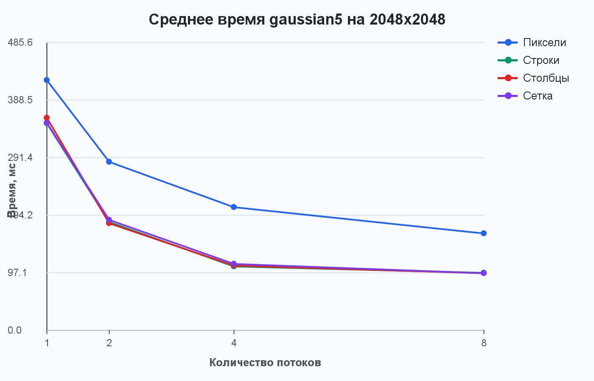

### Ускорение

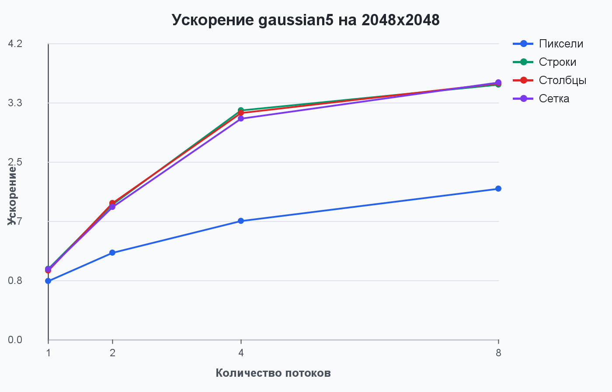

### Сравнение стратегий

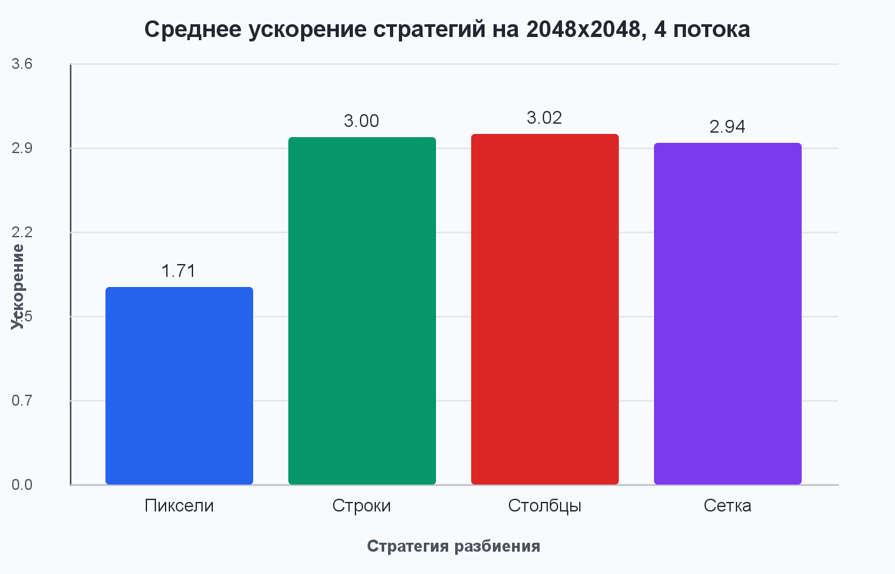

### Пропускная способность

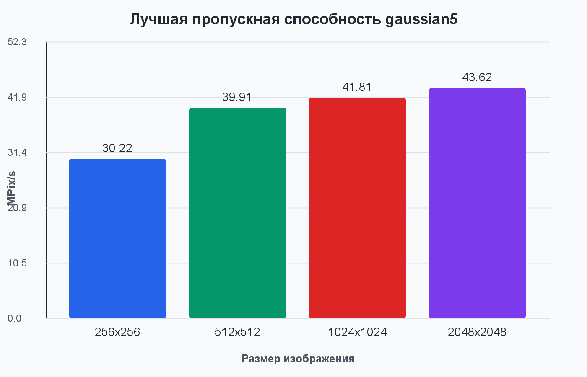

### Время всех фильтров на разных разрешениях

На этих графиках показаны все проверенные фильтры, а не только лучший вариант. Для каждого фильтра сравнивается последовательная версия и все четыре стратегии разбиения при `8` потоках.

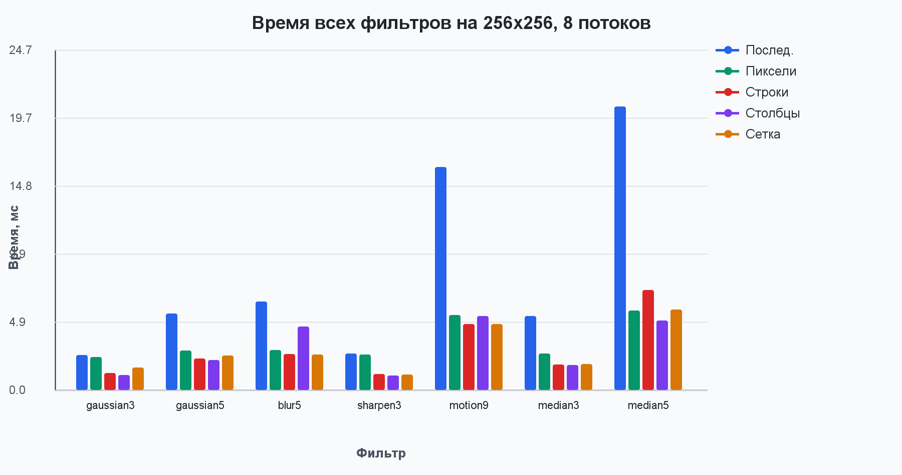

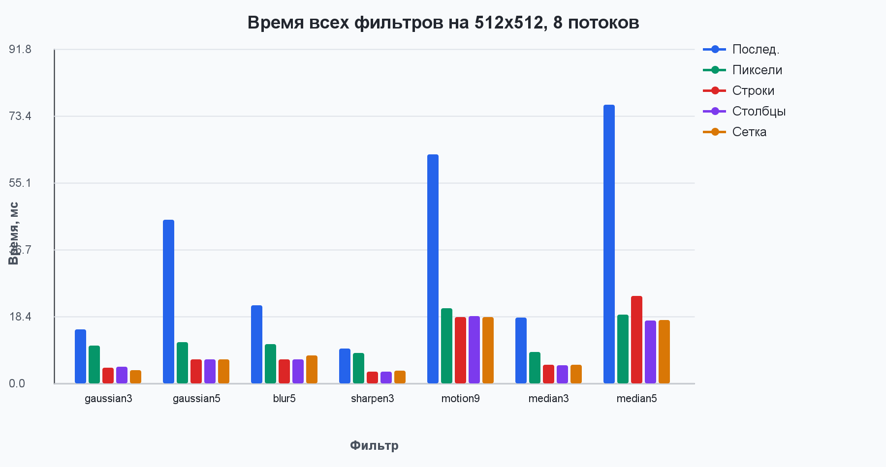

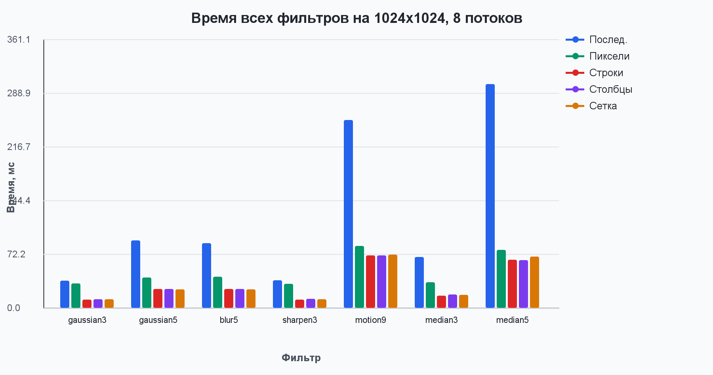

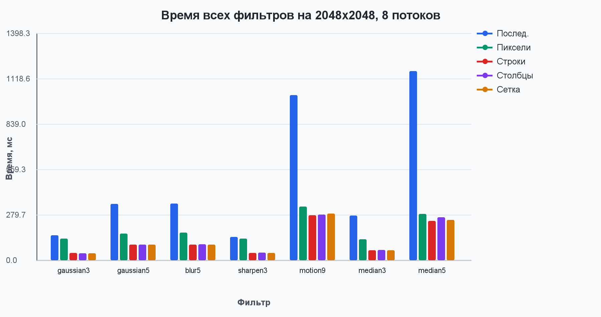

### Ускорение всех фильтров на разных разрешениях

На этих графиках показано ускорение всех параллельных стратегий для каждого фильтра на всех разрешениях.

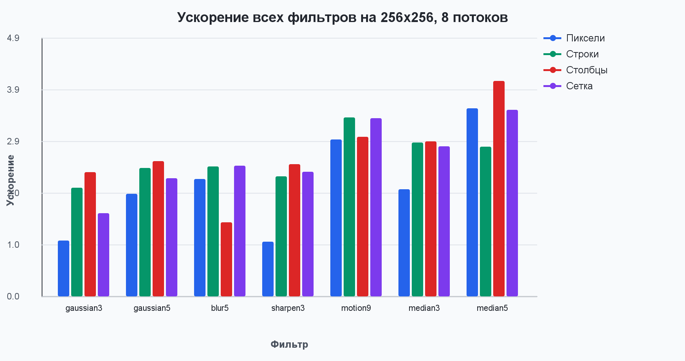

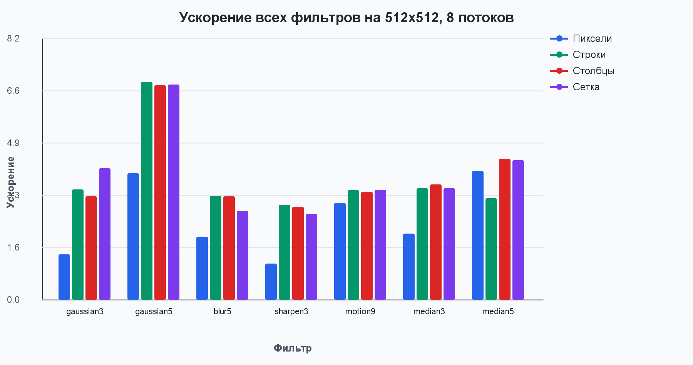

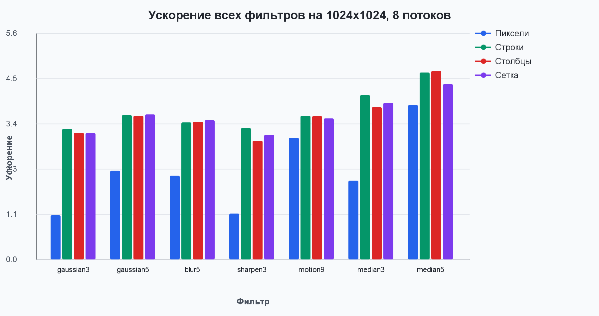

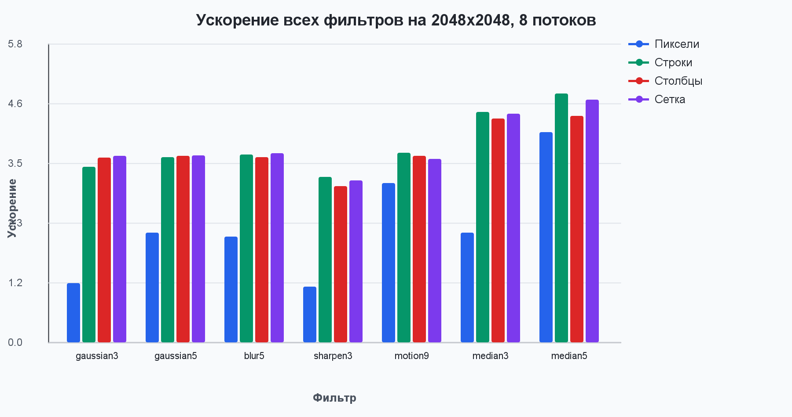

### Время при разном количестве потоков

На этих графиках для каждого фильтра сравниваются `1`, `2`, `4` и `8` потоков. Для каждого количества потоков я беру лучший результат среди всех стратегий разбиения, а полная детализация по стратегиям лежит в `parallel_results.csv`.

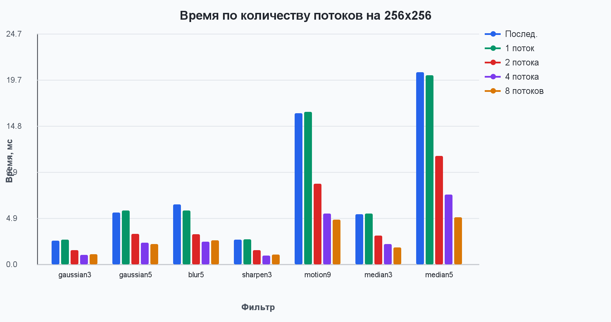

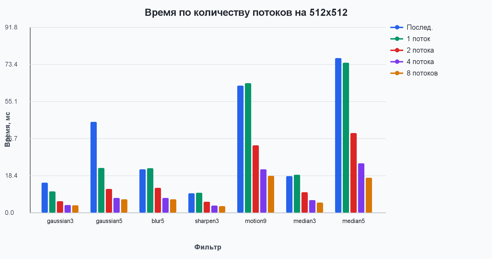

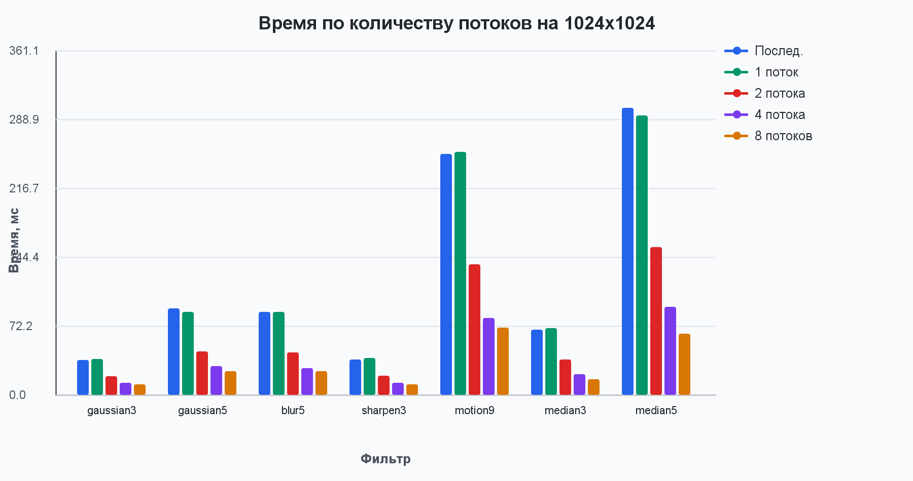

### Ускорение при разном количестве потоков

На этих графиках видно, как растёт ускорение при увеличении числа потоков.

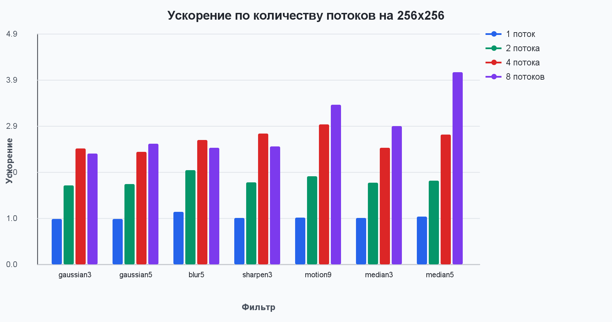

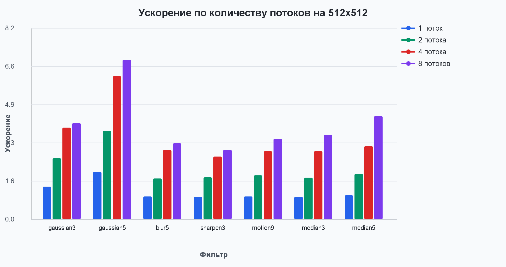

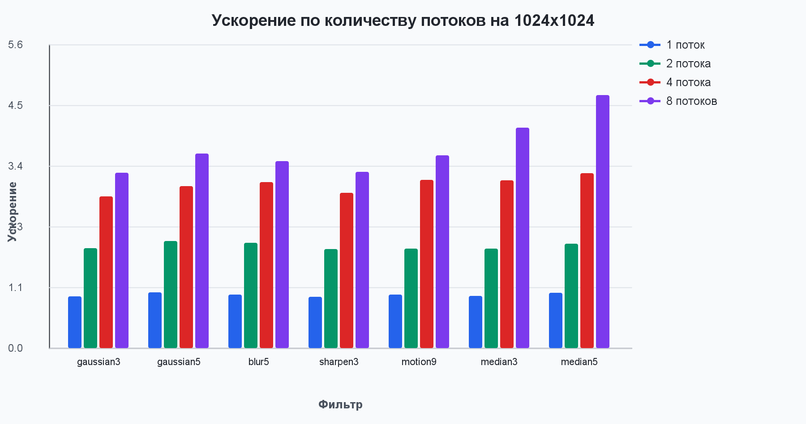

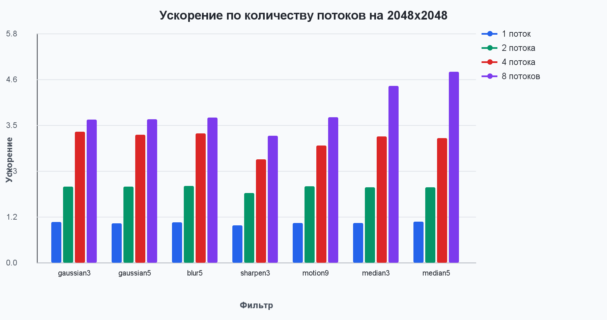

## Лучшие результаты на 2048x2048

| Фильтр | Лучшая стратегия | Потоков | Время, мс | MPix/s | Ускорение |
|--------|------------------|--------:|----------:|-------:|----------:|
| `gaussian3` | `grid` | 8 | 42.481 | 98.735 | 3.606 |
| `gaussian5` | `grid` | 8 | 96.145 | 43.625 | 3.611 |
| `blur5` | `grid` | 8 | 95.926 | 43.724 | 3.651 |
| `sharpen3` | `rows` | 8 | 45.218 | 92.757 | 3.194 |
| `motion9` | `rows` | 8 | 277.692 | 15.104 | 3.664 |
| `median3` | `rows` | 8 | 61.767 | 67.905 | 4.448 |
| `median5` | `rows` | 8 | 242.581 | 17.290 | 4.803 |

## Сравнение стратегий на 2048x2048 при 4 потоках

| Стратегия | Среднее время, мс | Среднее ускорение |
|-----------|------------------:|------------------:|
| `columns` | 163.969 | 3.022 |
| `rows` | 163.260 | 2.996 |
| `grid` | 165.302 | 2.944 |
| `pixels` | 251.540 | 1.706 |

## Пример подробного сравнения для gaussian5 на 2048x2048

| Стратегия | Потоков | Время, мс | Ускорение |
|-----------|--------:|----------:|----------:|
| `pixels` | 1 | 422.267 | 0.822 |
| `pixels` | 2 | 283.998 | 1.222 |
| `pixels` | 4 | 207.894 | 1.670 |
| `pixels` | 8 | 163.835 | 2.119 |
| `rows` | 1 | 349.204 | 0.994 |
| `rows` | 2 | 182.864 | 1.898 |
| `rows` | 4 | 107.868 | 3.218 |
| `rows` | 8 | 96.996 | 3.579 |
| `columns` | 1 | 358.573 | 0.968 |
| `columns` | 2 | 180.951 | 1.918 |
| `columns` | 4 | 109.182 | 3.179 |
| `columns` | 8 | 96.447 | 3.599 |
| `grid` | 1 | 349.924 | 0.992 |
| `grid` | 2 | 186.609 | 1.860 |
| `grid` | 4 | 111.912 | 3.102 |
| `grid` | 8 | 96.145 | 3.611 |

## Краткий анализ

На маленьком изображении `256x256` параллельная версия не всегда быстрее последовательной. Для лёгких фильтров накладные расходы на создание потоков и распределение работы могут быть сравнимы с самой фильтрацией.

На изображениях `1024x1024` и `2048x2048` параллелизация уже даёт стабильный выигрыш. Для `gaussian5` на `2048x2048` время уменьшилось с `347.144 мс` в последовательной версии до `96.145 мс` при стратегии `grid` и `8` потоках. Ускорение получилось `3.611` раза.

Стратегия `pixels` почти всегда хуже остальных. Она лучше балансирует работу, но каждый пиксель берётся через общий `AtomicInteger`, поэтому появляется заметный overhead. На `gaussian5` для `2048x2048` при `8` потоках она дала только `2.119` раза ускорения, тогда как `rows`, `columns` и `grid` дали примерно `3.58-3.61` раза.

Стратегии `rows`, `columns` и `grid` показали близкие результаты. На `2048x2048` при `4` потоках среднее ускорение получилось:

- `columns` — `3.022`
- `rows` — `2.996`
- `grid` — `2.944`
- `pixels` — `1.706`

Для тяжёлых фильтров выигрыш выше. Например, `median5` на `2048x2048` ускорился с `1165.234 мс` до `242.581 мс`, то есть в `4.803` раза. Это объясняется тем, что на каждый пиксель приходится больше вычислений, и накладные расходы потоков занимают меньшую долю общего времени.

## Вывод

Для больших изображений и тяжёлых фильтров параллельная реализация заметно эффективнее последовательной. Наиболее практичными вариантами разбиения оказались `rows`, `columns` и `grid`; они дают близкие результаты и хорошо масштабируются до `8` потоков. Стратегия `pixels` подходит хуже из-за постоянной синхронизации через общий счётчик.
